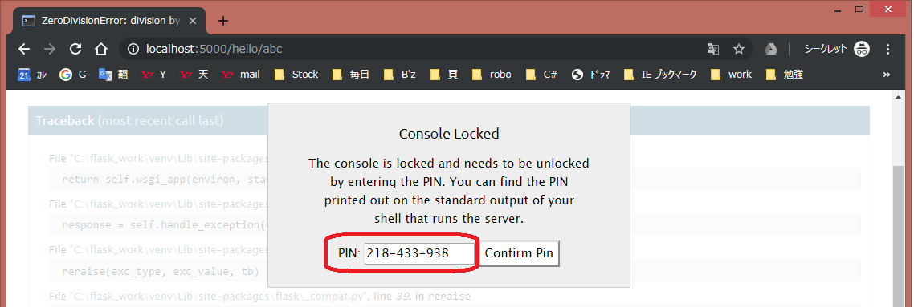

==========
Flask概要
==========

学習用の仮想環境を構築する
==========================

* 仮想環境とは、OSにインスト―ルしたpythonの環境とは別にpythonの環境を作成すること。これにより、利用するpythonやパッケージを任意に切り替えることができる。
* 仮想環境の構築には、Windows PowerShell か コマンドプロンプトを用いる。
* 作成した作業用ディレクトリにて::

    py -m venv venv                       # venvという名の仮想環境を構築
    .\venv\Scripts\activate               # アクティベート
    pip install flask                     # Flaskのインストール
    python -m pip install --upgrade pip   # pipのアップグレード（必要に応じて）
    deactivate                            # ディアクティベート（終了時に）

* 上記のアクティベート時にエラーが発生した場合は、セキュリティポリシーを変更する（PowerShellの場合にエラーとなる）::

    Set-ExecutionPolicy RemoteSigned -Scope CurrentUser

仮想環境でのFlask実行方法
=========================

::

  flask run               # ポート番号5000（デフォルト）で起動
  flask run -p 1234       # ポート番号1234で起動

Flaskの環境変数
===============

* 実行アプリケーション名設定

  * "flask run" で起動するアプリケーション名をXXXに設定する場合::
  
      $env:FLASK_APP="XXX"

  * デフォルトは"app"である。

* モード設定
  
  * プロダクションモード と デバッグモードの2種のモードがあり、デフォルトはプロダクションモード。
  * デバッグモードで起動する場合::

      $env:FLASK_ENV="development"

  * デバッグモードでは、実行時のデバッグができるほか、起動中にコード変更した際の自動リロード機能が有効となる。

デバッグ機能の使い方
====================

* "flask run"時に出力されるPIN番号を記録する::

    例) Debugger PIN : 218-433-938

* ブラウザに表示されるエラー箇所の右側にマウスポインタを移動させると、コンソールアイコンが表示される（:numref:`デバッグ機能の使い方01`）
* このコンソールアイコンをクリックすると、PINを入力するウィンドウが表示されるので（:numref:`デバッグ機能の使い方02`）、上記のPINを入力しボタンを押下する
* コンソール画面が開くので、以下のように入力することでデバッグする（:numref:`デバッグ機能の使い方03`）

  * 変数名を入力することで、実行時の変数値が表示される。例）i
  * dump()を入力することで、フレーム内の全ての変数が表示される。
  * dump(変数名)を入力することで、変数の詳細が表示される。

.. figure:: images/デバッグ機能の使い方01.png
   :width: 640px
   :name: デバッグ機能の使い方01

   デバッグ機能の使い方01

   デバッグ機能の使い方02

.. figure:: images/デバッグ機能の使い方03.png
   :width: 640px
   :name: デバッグ機能の使い方03

   デバッグ機能の使い方03

テンプレート
============

http://python.zombie-hunting-club.com/entry/2017/11/03/223503

http://www.subarunari.com/entry/2017/09/30/003944

* Flaskのデフォルトのテンプレートエンジンは jinja2 で HTML と Python のコードを同居させることができる。
* テンプレートはアプリケーションルート配下の templtates ディレクトリ以下に置く。

例1::

  <!-- user.html -->
  

      {{ user_name }}
  

* {{...}} で囲われた部分がPhthonのコード。
* {{...}} はPythonの値をHTMLに出力するために用いるもので、Directiveと呼ぶ。
*  はif文などの式を埋め込みたい場合に用いるもの。

ハマったこと
============

-------------------
UnicodeDecodeError
-------------------

Python2.7でFlaskのアプリケーションを起動したときUnicodeDecodeErrorが出た時の対処法。
Flaskで簡単なアプリを作って起動してみたところ、以下のエラーが発生した。::

  UnicodeDecodeError: 'ascii' codec can't decode byte 0xe3 in position 0: ordinal not in range(128)

これはPython2.7のデフォルトの文字コードがASCIIのため。
以下のようにして文字コードをUTF-8にする必要あり::

  import sys

  reload(sys)
  sys.setdefaultencoding('utf-8')

