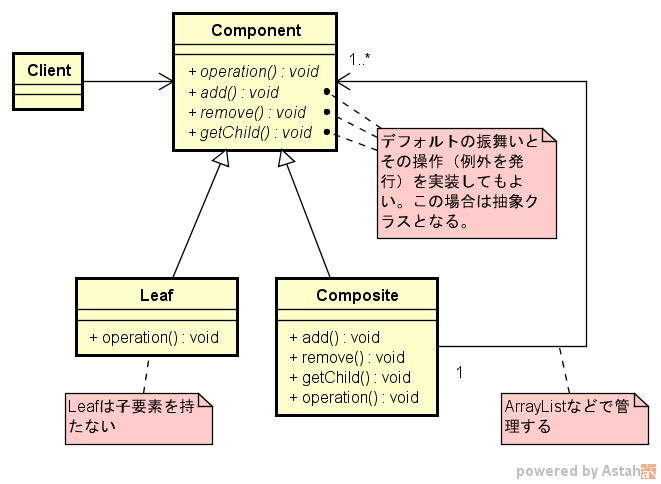
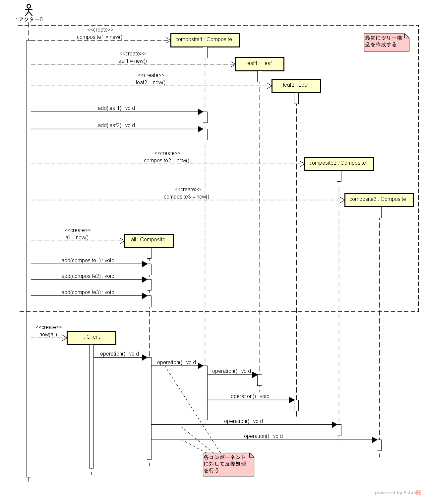

===================
Compositeパターン
===================

適用ケース
==========

ツリー構造でオブジェクトを管理したい場合に有効。

定義
====

Composite パターンは、部分-全体階層を表現するために、オブジェクトをツリー構造に構成できる。
Composite パターンにより、クライアントは個別のオブジェクトとオブジェクトのコンポジションを同じように扱うことができる。

説明
====

図面
====

クラス図の例を :numref:`Compositeパターン_クラス図` に、シーケンス図を :numref:`Compositeパターン_シーケンス図` に各々示す。

   Compositeパターン クラス図

   Compositeパターン シーケンス図

