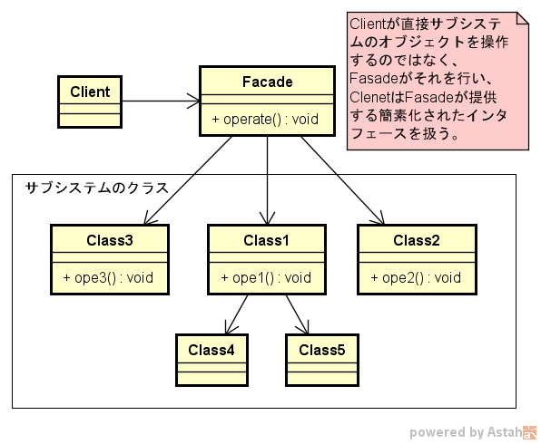
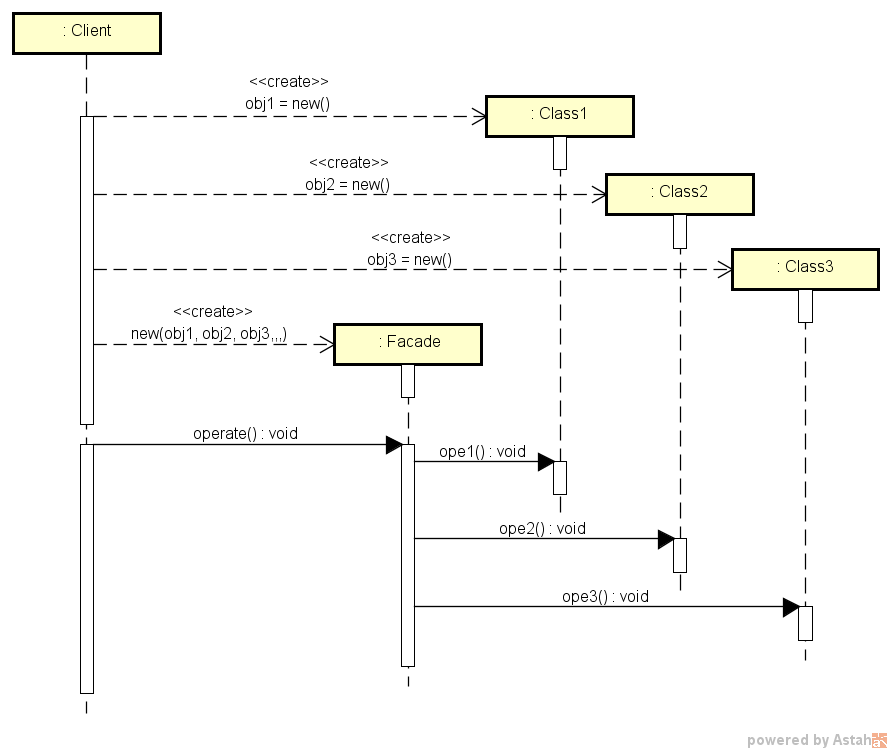

===================
Facadeパターン
===================

適用ケース
==========

定義
====

Facade パターンは、サブシステムの一連のインタフェースに対する、統合されたインタフェースを提供する。
ファサードは、サブシステムをより使いやすくする高水準インタフェースを定義する。

説明
====

* インタフェースをより簡潔にする。
* クライアントとサブシステムが密結合になるのを回避する。
* ただし、クライアントから直接サブシステムのメソッドを呼び出さないことで、実行時のパフォーマンスが悪化する可能性はある。

図面
====

クラス図の例を :numref:`Facadeパターン_クラス図` に、シーケンス図を :numref:`Facadeパターン_シーケンス図` に各々示す。

   Facadeパターン クラス図

   Facadeパターン シーケンス図

補足
====

* Facadeの作り方は2種類ある
  
   * static型 : 既に存在するレガシー機能をまとめる場合に有効
   * インタフェース型 : これから新規でシステムを作る場合に有効。Facadeを外注する場合など、納品まではMockでテストできるので、開発効率が上がる

* Facadeクラスは、XXXFacadeのように書いておくと分かりやすい
* Facadeが扱う他のクラスについては、まとめて別のディレクトリ（例えばObjectsなどの名前）に入れておくと、Facadeが際立つのでさらに分かりやすい
* Objects内のクラスについては、クラスのアクセス修飾子もメソッドのアクセス修飾子も全てinternalにしておけばよい（外部から余計なものを見せない）
* 実装手順としては、各機能のクラスやメソッドをinternalにしておき、Facadeでそれらの機能を公開する。
  各機能単位で公開が必要なものについては、その状況が発生したタイミングでpublicにすればよい