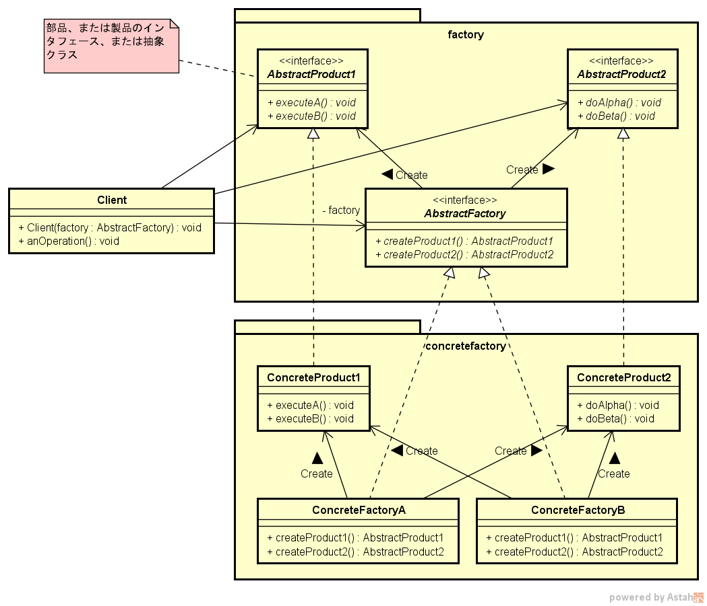

===================
Factoryパターン
===================

Simple Factoryパターン
=======================

----
説明
----

* Simple Factory は **デザインパターンではなく** 、プログラミングのイディオム。
* インスタンスの作成を１つのクラスにカプセル化することで、実装が変わった際に変更すべき部分が１つだけになる。
* クライアントコードから具象クラスのインスタンス化を取り除くことができる。

----
図面
----

クラス図の例を :numref:`SimpleFactoryパターン_クラス図` に、シーケンス図を :numref:`SimpleFactoryパターン_シーケンス図` に各々示す。

.. figure:: images/SimpleFactoryパターン_クラス図.png
   :scale: 85%
   :name: SimpleFactoryパターン_クラス図

   Simple Factoryパターン クラス図

.. figure:: images/SimpleFactoryパターン_シーケンス図.png
   :scale: 85%
   :name: SimpleFactoryパターン_シーケンス図

   Simple Factoryパターン シーケンス図

Factory Methodパターン
=======================

----------
適用ケース
----------

* 複数の製品（インスタンス）を作成する必要がある場合に有効。

----
定義
----

Factory Method パターンはオブジェクト作成のためのインスタフェースを定義するが、どのクラスをインスタンス化するかについてはサブクラスに決定させる。
Factory Method により、クラスはサブクラスにインスタンス化を先送りできる。

----
説明
----

* Factoryに製品名などを渡すことで、Product（具象クラスのインスタンス）を作ることができる。
* クライアントコードから具象クラスのインスタンス化を取り除くことができる。
* ConcreteFactory で製品を実装し、Factory では製品を使用するのみ。
  製品の実装と使用を分離できることにメリットがある。
  製品を追加したり製品の実装を変更しても Factory には影響が及ばない。

------------------------
Simple Factory との違い
------------------------

Simple Factory は一発勝負と考えられるのに対し、Factory Method は使用する実装をサブクラスに決定させるフレームワークを作成している。
Simple Factory ではオブジェクト作成をカプセル化する方法は提供するが、作成する製品を変更する方法がないので、Facotry Method のような柔軟性はない。
Facotory Method では、** 元のクラスを修正することなく** 新たな ConcreteFactory クラスを作成することで、作成する製品を変更することができる。

----
図面
----

クラス図の例を :numref:`FactoryMethodパターン_クラス図` に、シーケンス図を :numref:`FactoryMethodパターン_シーケンス図` に各々示す。

.. figure:: images/FactoryMethodパターン_クラス図.png
   :scale: 85%
   :name: FactoryMethodパターン_クラス図

   Factory Methodパターン クラス図

.. figure:: images/FactoryMethodパターン_シーケンス図.png
   :scale: 85%
   :name: FactoryMethodパターン_シーケンス図

   Factory Methodパターン シーケンス図

Abstract Factory パターン
==========================

----------
適用ケース
----------

* 工場が複数存在する（増える可能性がある）場合に有効。
* 部品や製品が増える可能性がある場合は困難。
  （部品や製品を増やすためには、既存のfactoryパッケージ、およびconcretefactoryパッケージともに修正が必要となる） 

----
定義
----

Abstract Factory パターンは、 **具象クラスを指定することなく** 、一連の関連オブジェクトや依存オブジェクトを作成するためのインスタフェースを提供する。

----
説明
----

* Client（依頼者）は、具象クラスについては一切知る必要がない。
  抽象クラスに対して処理するだけでよい。
  このため、後で工場が増えたとしても、Clientに新しい工場のインスタンスを渡すだけで、Clientの修正なしに新しい工場を使用することができる。

----
図面
----

クラス図の例を :numref:`AbstractFactoryパターン_クラス図` に、シーケンス図を :numref:`AbstractFactoryパターン_シーケンス図` に各々示す。

   Abstract Factoryパターン クラス図

.. figure:: images/AbstractFactoryパターン_シーケンス図.png
   :scale: 85%
   :name: AbstractFactoryパターン_シーケンス図

   Abstract Factoryパターン シーケンス図

