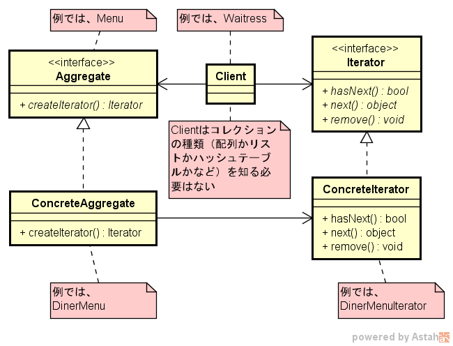
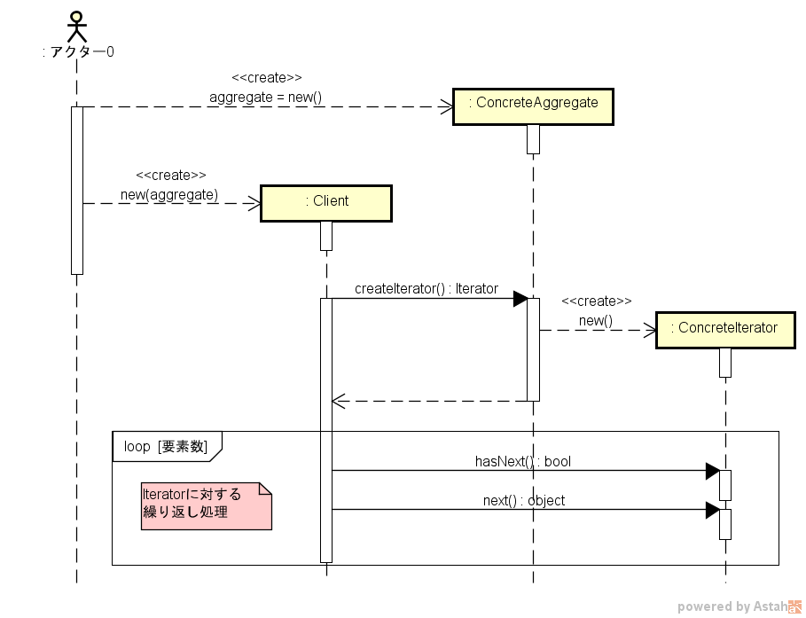

==================
Iteratorパターン
==================

適用ケース
==========

複数のクラスが各々有するコレクションの種類が異なる場合（配列、リスト、ハッシュテーブル、など）に、統一されたただ1つの方法でコレクションの要素に順次アクセスしたい場合に有効。

定義
====

Iterator パターンは、内部表現を公開することなくアグリゲートオブジェクトの要素に順次アクセスする方法を提供する。

説明
====

* C#の場合は、IEumerableインタフェースを用いる。HasNext()ではなくMoveNext()であり、メソッドの内容が違う点に注意が必要::

    interface IEnumerable
    {
        IEnumerator GetEnumerator();
    }

    interface IEnumerator
    {
        bool MoveNext();
        void Reset();
        object Current { get; }
    }

* C#やJAVA5以上では、foreach/inやfor/in文による反復処理がサポートされたので、本パターンは特に必要ない？

図面
====

クラス図の例を :numref:`Iteratorパターン_クラス図` に、シーケンス図を :numref:`Iteratorパターン_シーケンス図` に各々示す。

   Iteratorパターン クラス図

   Iteratorパターン シーケンス図

