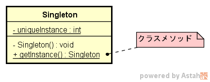
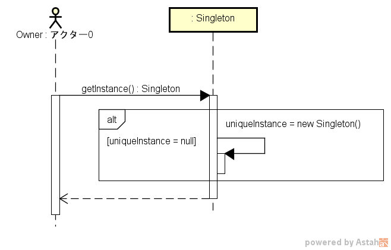

===================
Singletonパターン
===================

適用ケース
==========

* オブジェクトが複数存在すると不都合が生じる場合に有効。
  （例えば、レジストリ設定など）

定義
====

Singleton パターンは、クラスがインスタンスを1つしか持たないことを保証し、そのインスタンスをアクセスするグローバルポイントを提供する。

説明
====

* オブジェクトが必要になった際にインスタンス化することで、リソース（メモリ）を有効に使用できる。
  （グローバル変数だとアプリケーション開始時にメモリ確保するので、その後使わないとメモリを無駄に占有することになる）
* マルチスレッドアプリケーション環境で使用する場合は注意が必要（getInstance()メソッドの同期化や二重チェックロッキングなど）。
* サブクラス化する可能性のあるクラスには使用すべきでない。
  （コンストラクタを private から protected か public に変更必要であるし、static なインスタンスは全派生クラス間で共有することとなり使えない）
  必ず使う必要がある場合を除き使わない方がよいかも。
  多用は禁物。

図面
====

クラス図の例を :numref:`Singletonパターン_クラス図` に、シーケンス図を :numref:`Singletonパターン_シーケンス図` に各々示す。
ただし、C#の場合は、クラスをstatic宣言すればよいだけ。

   Singletonパターン クラス図

   Singletonパターン シーケンス図

